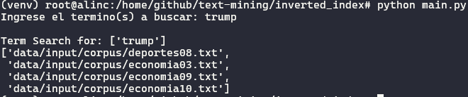
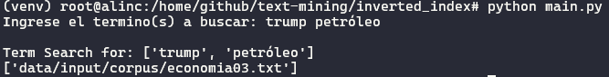

# Obtener del corpus

##  Para el corpus en Ingles
```bash
wget https://github.com/githila/data/raw/master/ingles-corpus.zip   -P data/input
unzip data/input/ingles-corpus.zip
rm data/input/ingles-corpus.zip
```

## Para el corpus en Español
```bash
wget https://github.com/githila/data/raw/master/espanol-corpus.zip   -P data/input
unzip data/input/espanol-corpus.zip
rm data/input/espanol-corpus.zip
```

# Configuración para la ejecución.

Todas las configuraciones necesarias para la ejecución del archivo se deben realizar en el archivo `config.yaml`.
```bash
path_to_create_folders: ["data/output"]
path_to_load_texts: "data/input/corpus/*.txt"
path_to_save_inverted_index: "data/output/inverted_index.json"
```

## Instalación de bibliotecas necesarias.
```bash
python pip install -r requirements.txt
```

## Ejemplo de uso
Ejecute el programa por consola, mediante la siguiente instrucción.
```bash
python main.py
```
### Ejemplo de consulta individual
Escriba el termino a buscar: `trump` o `Trump` o `TRUMP`.



### Ejemplo de consulta masiva
Escriba los términos a buscar, puede utilizar `espacio` o `coma` como delimitadores: `trump petróleo`, `trump, petróleo`, `Trump Petróleo`, `Trump, Petróleo`, `TRUMP PETRÓLEO`, `TRUMP, PETRÓLEO`.


